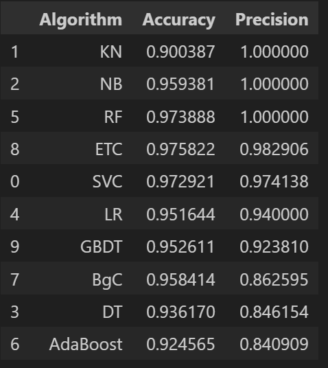
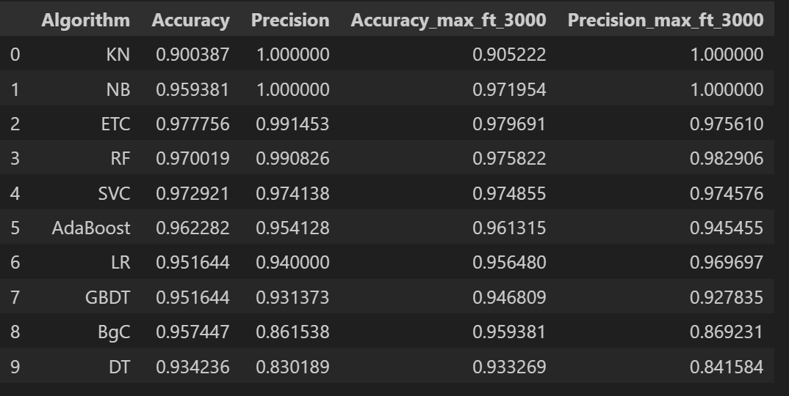

# Precision Spam Detection Using Multinomial Naive Bayes

## Overview
This project implements a machine learning-based spam detection system to classify SMS messages as either spam or ham (non-spam). The dataset used contains SMS messages labeled as spam or ham, and the goal is to build a model that accurately identifies spam messages with high precision. The project follows a structured pipeline, from data cleaning to model deployment, and includes a web interface for real-time predictions.

## Dataset
The dataset (spam.csv) consists of 5,572 SMS messages with the following columns:
v1: Label (ham or spam)
v2: Text of the SMS message
Unnamed: 2, Unnamed: 3, Unnamed: 4: Mostly empty columns with sparse data

After preprocessing, the dataset is reduced to 5,169 unique messages due to duplicate removal.

## Steps Taken
The project follows a systematic approach to build, evaluate, and deploy the spam detection model. Below are the detailed steps:

## 1. Data Cleaning
Objective: Prepare the dataset for analysis by removing noise and irrelevant data.
Actions:
- Dropped the last three columns (Unnamed: 2, Unnamed: 3, Unnamed: 4) due to high missing value rates (e.g., only 50, 12, and 6 non-null entries, respectively).
- Renamed columns v1 to target and v2 to text for clarity.
- Encoded the target column using LabelEncoder (ham → 0, spam → 1).
- Checked for missing values (none found).
- Removed 403 duplicate rows, resulting in 5,169 unique entries.

Outcome: A clean dataset with two columns (target, text) and no missing or duplicate values.

## 2. Exploratory Data Analysis (EDA)
**Objective**: Understand the data distribution and characteristics.
**Actions**:
- Analyzed the class distribution: 4,516 ham (87.4%) and 653 spam (12.6%) messages, indicating an imbalanced dataset.
- Visualized the class distribution using a pie chart (via matplotlib and seaborn).
- Explored text characteristics (e.g., word count, character count) to understand differences between spam and ham messages.

**Outcome**: Confirmed the dataset is imbalanced, with spam messages being less frequent. Spam messages often contained promotional keywords (e.g., "win", "free").

## 3. Text Preprocessing
**Objective**: Transform raw text into a format suitable for machine learning.
**Actions**:
- Applied text preprocessing steps:
- Converted text to lowercase.
- Tokenized text into words.
- Removed stopwords (using nltk stopwords list).
- Removed punctuation and special characters.
- Applied stemming using PorterStemmer to reduce words to their root form.

Used TfidfVectorizer to convert text into numerical features (TF-IDF vectors).
- Initially set max_features=3000 to limit the vocabulary size.
Split the data into training (80%) and testing (20%) sets using train_test_split with random_state=2.

**Outcome**: Transformed text data into a 5,169 × 3,000 feature matrix (X) and corresponding labels (y).

## 4. Model Building
**Objective**: Train multiple machine learning models to identify the best-performing one.
**Actions**:
- Tested 10 classification algorithms:
- Support Vector Classifier (SVC)
- K-Neighbors Classifier (KN)
- Multinomial Naive Bayes (NB)
- Decision Tree (DT)
- Logistic Regression (LR)
- Random Forest (RF)
- AdaBoost
- Bagging Classifier (BgC)
- Extra Trees Classifier (ETC)
- Gradient Boosting Decision Tree (GBDT)
Evaluated models using accuracy and precision metrics, with a focus on precision due to the importance of minimizing false positives (misclassifying ham as spam).
Used a custom train_classifier function to compute accuracy and precision for each model.

**Outcome**: Multinomial Naive Bayes (NB) achieved the highest precision (1.0) with an accuracy of 0.9719, making it a strong candidate.

## 5. Model Evaluation
**Objective**: Compare model performance and select the best model.
**Actions**:
- Compiled results into a DataFrame (performance_df) sorted by precision.
- Key results (initial evaluation with max_features=3000):

<div align="center">
  
</div>
**Outcome**: Multinomial Naive Bayes was selected due to its perfect precision (1.0) and high accuracy (0.9719).

## 6. Model Improvement
**Objective**: Enhance the model's performance through hyperparameter tuning and ensemble methods.
**Actions**:
- TF-IDF Tuning: Adjusted TfidfVectorizer to max_features=3000 (previously unspecified) to capture more features.
- Re-evaluated models with updated TF-IDF features:
<div align="center">
  
</div>

**Voting Classifier:**
- Combined SVC, Multinomial NB, and Extra Trees Classifier using soft voting.
- Result: Accuracy = 0.9816, Precision = 0.9917

**Stacking Classifier:**
- Used SVC, Multinomial NB, and Extra Trees as base estimators with Random Forest as the final estimator.
- Result: Accuracy = 0.9787, Precision = 0.9394

**Outcome**: Multinomial Naive Bayes with max_features=3000 remained the best model (Precision = 1.0). Voting and stacking improved accuracy but reduced precision, so they were not adopted.

## 7. Model Export
**Objective**: Save the trained model and vectorizer for deployment.
**Actions**:
- Saved the TfidfVectorizer as vectorizer.pkl.
- Saved the Multinomial Naive Bayes model as model.pkl using pickle.

**Outcome**: Model and vectorizer are ready for integration into a web application.

## 8. Website and Deployment (Planned)
Objective: Create a user-friendly interface for spam detection using Streamlit and deploy it.
Planned Actions:
Develop a web application using a framework like Flask or Django.
Integrate the saved vectorizer.pkl and model.pkl for real-time predictions.
Deploy the application on Heroku.

**Status**: Not implemented in the provided code but outlined as future steps.

## Code Description
The implementation is contained in a Jupyter Notebook (Spam-detection.ipynb). Key components include:
  
### Libraries Used:
Data manipulation: pandas, numpy
Text preprocessing: nltk (for stemming, stopwords), sklearn.feature_extraction.text.TfidfVectorizer
Machine learning: sklearn (classifiers, metrics, ensemble methods)
Visualization: matplotlib, seaborn

### Key Functions:
train_classifier(clf, X_train, y_train, X_test, y_test): Trains a classifier and returns accuracy and precision.
Text preprocessing pipeline: Custom function to lowercase, tokenize, remove stopwords/punctuation, and stem text.

### Model Pipeline:
Load and clean data → Preprocess text → Vectorize using TF-IDF → Train/test split → Train multiple models → Evaluate → Tune and ensemble → Export best model.

### Results
The Multinomial Naive Bayes model with max_features=3000 was selected as the final model due to its superior performance:

**Accuracy:** 0.9719 (97.19% of test predictions correct)
**Precision:** 1.0 (100% of predicted spam messages were actually spam)
**Confusion Matrix:**
[[896   0]
[ 29 109]]

True Negatives (Ham correctly predicted): 896
False Positives (Ham misclassified as Spam): 0
False Negatives (Spam misclassified as Ham): 29
True Positives (Spam correctly predicted): 109

The perfect precision score ensures no ham messages are incorrectly flagged as spam, which is critical for user experience in SMS filtering applications.

## Dependencies
To run the project, install the following Python libraries:
```bash:
pip install pandas numpy scikit-learn nltk matplotlib seaborn
```

Download NLTK data:
```bash:
import nltk
nltk.download('punkt')
nltk.download('stopwords')
```
## How to Run
1. Clone the repository or download the Spam-detection.ipynb notebook.
2. Ensure the spam.csv dataset is in the same directory.
3. Install dependencies (see above).
4. Run the Jupyter Notebook to execute the pipeline.
5. The trained model (model.pkl) and vectorizer (vectorizer.pkl) will be saved in the working directory.

## Future Work
- Implement the web application for real-time spam detection.
- Deploy the application on Heroku.
- Explore deep learning models (e.g., LSTM, BERT) for potentially better performance.
- Address class imbalance using techniques like SMOTE or weighted loss functions.

License
This project is licensed under the MIT License.
